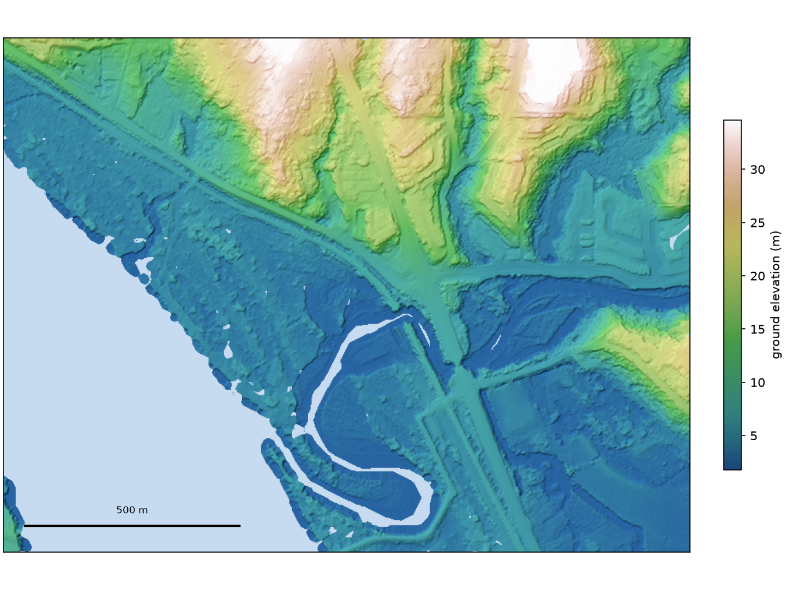

```{r setup, echo=FALSE, include=TRUE}
knitr::opts_chunk$set(echo = TRUE, message = FALSE, warning = FALSE, dpi = 60,
                      out.width = "100%")
```

```{r source, echo=FALSE, include=FALSE}
suppressMessages(library(sf))
sf::sf_use_s2(FALSE)
source("scripts/readme_functions.R")

# DT names each widget container `htmlwidget-<random hex>`. Seeded, a re-render rewrites
# index.html only when the data moved (stac_floodplains_bc).
set.seed(42)
htmlwidgets::setWidgetIdSeed(42)
```

```{r build, echo=FALSE, eval=FALSE}
# Both targets come from this file. `rmd_on` switches what differs between them;
# `update_query` decides whether the network is used at all.
#
#   update_query = TRUE   the API, the bucket, two header reads and the DEM demo ->
#                         data/readme_cache.rds, data/readme_dem.json, fig/kanaka_dem.png
#   update_query = FALSE  the cache only; no network
#
# Run the md first: it is the one that refreshes the cache the html then reads.
rmarkdown::render(
  "README.Rmd",
  output_format = "github_document",
  params = list(rmd_on = FALSE, update_query = TRUE)
)

rmarkdown::render(
  "README.Rmd",
  output_format = "html_document",
  output_file = "index.html",
  params = list(rmd_on = TRUE, update_query = FALSE)
)
```

```{r example-run, ref.label=c("example", "header"), echo=FALSE, include=FALSE, eval=isTRUE(params$update_query)}
```

```{r query, echo=FALSE, include=FALSE}
if (isTRUE(params$update_query)) {
  all <- pc_readme_fetch()
  # The example must show both kinds of item, or it demonstrates half the collection.
  stopifnot(any(vapply(r$features, \(f) !is.null(f$assets$copc), logical(1))),
            any(vapply(r$features, \(f) is.null(f$assets$copc), logical(1))))
  # The DEM demo is Python (laspy reads a COPC window over HTTPS); it writes
  # fig/kanaka_dem.png and data/readme_dem.json.
  if (system2("uv", c("run", "--group", "readme", "python", "scripts/readme_dem.py")) != 0L) {
    stop("scripts/readme_dem.py failed", call. = FALSE)
  }
  groups <- sf::st_drop_geometry(all$items) |>
    dplyr::group_by(group) |>
    dplyr::summarise(items = dplyr::n(), copc = sum(copc), points = sum(points)) |>
    dplyr::arrange(group)
  saveRDS(list(
    version = all$version,
    fetched_at = all$fetched_at,
    groups = groups,
    rows = pc_readme_rows(r$features),
    example = list(item = it$id, laz = it$assets$laz, copc = it$assets$copc,
                   h_laz = h_laz, h_copc = h_copc, off_laz = off_laz, off_copc = off_copc)
  ), CACHE)
}
# A missing cache must stop the render rather than produce a page with no numbers in it.
for (f in c(CACHE, DEM_JSON)) {
  if (!file.exists(f)) {
    stop(f, " is missing — render once with params$update_query = TRUE", call. = FALSE)
  }
}
cached <- readRDS(CACHE)
dem <- jsonlite::fromJSON(DEM_JSON, simplifyVector = FALSE)
groups <- cached$groups
rows <- cached$rows
ex <- cached$example
n_items <- sum(groups$items)
n_copc <- sum(groups$copc)
fmt <- function(x) format(x, big.mark = ",", scientific = FALSE, trim = TRUE)
```

<!-- README.md is generated from README.Rmd. Please edit that file -->

```{r badges, echo=FALSE, results="asis"}
# README.md only. `self_contained: true` would make pandoc fetch and embed each badge, a
# network call inside a render meant to need none (stac_floodplains_bc).
if (identical(params$rmd_on, FALSE)) {
  cat(paste0(
    "\n",
    "\n",
    "\n"
  ))
}
```

**`stac-pointcloud-bc`** catalogues British Columbia's [LidarBC](https://lidar.gov.bc.ca/) point clouds as a [SpatioTemporal Asset Catalog](https://stacspec.org/) (STAC): one item per `.laz` file on the province's objectstore, so a client can find the files covering an area without downloading any of them first. Each item's footprint, point count, point format and coordinate reference system come from the file's own LAS header and the CRS record that follows it, read at build time with range requests; the `.laz` stays where the province publishes it, and nothing is copied. The collection holds **`r fmt(n_items)` items in `r nrow(groups)` mapsheet-years** so far. The endpoint is <https://images.a11s.one>, readable from the [`rstac`](https://brazil-data-cube.github.io/rstac/) R package, `pystac-client`, QGIS 3.42+, or any other STAC client.

## From a search to a DEM, without downloading a file

```{r dem-fig, echo=FALSE, fig.alt="A hillshaded bare-earth elevation model of the lower Kanaka Creek where it meets the Fraser River at Maple Ridge, built from lidar ground returns: the creek's meander, the terrace escarpment above the floodplain, and the highway and rail embankments, with water in light blue."}

```

`r dem_mb <- function(b) fmt(round(b / 1e6)); paste0("The lower Kanaka Creek where it meets the Fraser at Maple Ridge. One STAC search for a ", fmt(dem$window_m[[1]] / 1000), " × ", fmt(dem$window_m[[2]] / 1000), " km window returned the ", length(dem$items), " items covering it. Reading only that window from each item's ")` `copc` `r paste0("asset transferred ", dem_mb(dem$bytes_read), " MB of the ", dem_mb(dem$bytes_files), " MB in those files: ", fmt(round(dem$points / 1e6, 1)), " million points, ", fmt(round(dem$ground_points / 1e6, 1)), " million of them ground returns, gridded at ", dem$cell_m, " m into the surface above. Light blue is water, which returns almost no pulses.")` A `laz` asset has no spatial index, so the same window from it means downloading the whole file; the window read is what the `copc` asset adds. `r n_go <- length(dem$ground_only_items); if (n_go > 0) paste0(if (n_go == 1) "One" else fmt(n_go), " of these ", length(dem$items), " items ", if (n_go == 1) "holds" else "hold", " ground returns only, so trees and buildings cannot be measured from ", if (n_go == 1) "it" else "them", ": a LidarBC delivery is not always the full point cloud.")`

```{python dem-code, eval=FALSE, python.reticulate=FALSE, code=pc_readme_lines("scripts/readme_dem.py", "shown on the landing page")}
```

The whole script, with the gridding, is [`scripts/readme_dem.py`](https://github.com/NewGraphEnvironment/stac_pointcloud_bc/blob/main/scripts/readme_dem.py).

## What an item holds

| asset | what it is |
|---|---|
| `laz` | the province's file, on `nrs.objectstore.gov.bc.ca`. Every item has one, and it is the source of record |
| `copc` | the [Cloud Optimized Point Cloud](https://copc.io/) that Natural Resources Canada's [CanElevation](https://open.canada.ca/data/en/dataset/7069387e-9986-4297-9f55-0288e9676947) series publishes under the same file name, where it does: **`r fmt(n_copc)` of `r fmt(n_items)` items** |

**A `copc` asset is linked only after its header has been checked**, not on the file name alone: the same point count, the same horizontal CRS, and a box within 0.05 m of the LidarBC file's. That test cannot see a reclassified re-delivery published under the same name. A COPC can also be a different LAS version and point format from its source, so the item's `pc:schemas` describe the `laz`, and the `copc` asset carries its own `nge:las_version` and `nge:point_format`. Which CanElevation projects republish LidarBC, and how that was measured, is in [`research/canelevation_overlap.md`](https://github.com/NewGraphEnvironment/stac_pointcloud_bc/blob/main/research/canelevation_overlap.md).

Items carry the [pointcloud](https://github.com/stac-extensions/pointcloud), [projection](https://github.com/stac-extensions/projection) and [file](https://github.com/stac-extensions/file) extensions. Their dates are the delivery's **year** (`start_datetime` / `end_datetime`), because several deliveries name files with processing dates rather than acquisition dates; the file name's own date token is kept in `nge:filename_date`.

## What is indexed

The first increment is every `pointcloud/*.laz` in the 11 mapsheet-years whose `dsm/` directory holds only `.laz`, where [stac_dem_bc](https://github.com/NewGraphEnvironment/stac_dem_bc) reports DEM tiles with no surface model. The rest of the province's `pointcloud/*.laz` is not yet indexed, and the `dsm/*.laz` are not indexed at all: in every tile compared they were an RGB-colourised copy of the point cloud, not a surface model ([#3](https://github.com/NewGraphEnvironment/stac_pointcloud_bc/issues/3), [`research/laz_header_read.md`](https://github.com/NewGraphEnvironment/stac_pointcloud_bc/blob/main/research/laz_header_read.md)). [NEWS.md](https://github.com/NewGraphEnvironment/stac_pointcloud_bc/blob/main/NEWS.md) says what each release published.

```{r groups, echo=FALSE}
knitr::kable(
  dplyr::transmute(groups,
    `mapsheet / year` = group,
    items = fmt(items),
    `with copc` = ifelse(copc == 0, "", fmt(copc)),
    points = paste0(fmt(round(points / 1e9, 1)), " billion")
  ),
  align = c("l", "r", "r", "r")
)
```

`r paste0("Catalogue version ", cached$version, ", read from the API on ", cached$fetched_at, ". Every id the bucket's collection.json links was served by the API, and nothing else was.")`

## Query it

Use [`bcdata`](https://github.com/bcgov/bcdata) for an area of interest and `rstac` to search the collection for the items intersecting it. Below: every point cloud in the Similkameen River watershed group.

```{r example, eval=FALSE}
# Freshwater Atlas watershed groups, by the record's permanent id.
aoi <- bcdata::bcdc_query_geodata("51f20b1a-ab75-42de-809d-bf415a0f9c62") |>
  bcdata::filter(WATERSHED_GROUP_CODE == "SIML") |>
  bcdata::collect() |>
  sf::st_transform(crs = 4326)

r <- rstac::stac("https://images.a11s.one/") |>
  rstac::stac_search(
    collections = "stac-pointcloud-bc",
    intersects = jsonlite::fromJSON(
      geojsonsf::sf_geojson(aoi, atomise = TRUE, simplify = FALSE),
      simplifyVector = FALSE
    )$geometry,
    limit = 1000
  ) |>
  rstac::post_request() |>
  rstac::items_fetch()
```

**`r fmt(nrow(rows))` items**, `r fmt(sum(!is.na(rows$copc)))` of them with a `copc` asset. `r if (identical(params$rmd_on, FALSE)) "Ten are below, five of each kind; every one, with download links for both assets, is in the table at <https://www.newgraphenvironment.com/stac_pointcloud_bc/>."`

```{r tab-md, echo=FALSE, eval=identical(params$rmd_on, FALSE)}
md_link <- function(href) ifelse(is.na(href), "", paste0("[", basename(href), "](", href, ")"))
rbind(head(rows[!is.na(rows$copc), ], 5), head(rows[is.na(rows$copc), ], 5)) |>
  dplyr::transmute(item, points = fmt(points), laz = md_link(laz), copc = md_link(copc)) |>
  knitr::kable(align = c("l", "r", "l", "l"))
```

```{r tab-cap, echo=FALSE, results="asis", eval=identical(params$rmd_on, TRUE)}
my_tab_caption_rmd(paste0("Every item the search above returns, with links to its `laz` ",
                          "and, where there is one, its `copc`."))
```

```{r tab-dt, echo=FALSE, eval=identical(params$rmd_on, TRUE)}
rows |>
  dplyr::mutate(laz = pc_readme_link(laz), copc = pc_readme_link(copc)) |>
  my_dt_table(cols_freeze_left = 1, escape = FALSE)
```

### Read a header without downloading the file

A LAS file starts with a 375-byte public header holding its version, point format, point count and bounding box. One HTTP range request reads it from either asset, whatever the file's size. `pc_readme_header()` in [`scripts/readme_functions.R`](https://github.com/NewGraphEnvironment/stac_pointcloud_bc/blob/main/scripts/readme_functions.R) does it with `httr2` and base R, with no LAS library, and checks the result against the item:

```{r header, eval=FALSE}
it <- r$features[order(vapply(r$features, \(f) f$id, ""))] |>
  Filter(f = \(f) !is.null(f$assets$copc)) |>
  (\(x) x[[1]])()

h_laz <- pc_readme_header(it$assets$laz$href)
h_copc <- pc_readme_header(it$assets$copc$href)

# Same point count as the item's `pc:count`, and a box within 0.05 m of its `proj:bbox`.
off_laz <- pc_readme_header_check(h_laz, it)
off_copc <- pc_readme_header_check(h_copc, it)
```

```{r header-tab, echo=FALSE}
hdr <- function(h, a, off) {
  c(`LAS version` = h$las_version, `point format` = h$point_format,
    points = fmt(h$point_count),
    `min x, y` = paste(sprintf("%.2f", h$mins[1:2]), collapse = ", "),
    `max x, y` = paste(sprintf("%.2f", h$maxs[1:2]), collapse = ", "),
    `offset from the item's box (m)` = sprintf("%.3f", off),
    `bytes read / file size` = paste0("375 / ", fmt(a[["file:size"]])))
}
knitr::kable(
  data.frame(check.names = FALSE,
    field = names(hdr(ex$h_laz, ex$laz, ex$off_laz)),
    laz = unname(hdr(ex$h_laz, ex$laz, ex$off_laz)),
    copc = unname(hdr(ex$h_copc, ex$copc, ex$off_copc))),
  align = c("l", "r", "r")
)
```

The item is `r ex$item`. `r if (identical(ex$h_laz$las_version, ex$h_copc$las_version) && identical(ex$h_laz$point_format, ex$h_copc$point_format)) paste0("Both files are LAS ", ex$h_laz$las_version, " point format ", ex$h_laz$point_format, ", with the same count and box: CanElevation's copy of the province's file, reorganised as a COPC so a client can read one region or one level of detail without the rest.") else paste0("CanElevation re-encoded the province's LAS ", ex$h_laz$las_version, " point format ", ex$h_laz$point_format, " as LAS ", ex$h_copc$las_version, " point format ", ex$h_copc$point_format, ", so the headers differ in version and format but agree on the points.")`

## Sister collections on the same endpoint

- [`stac_dem_bc`](https://github.com/NewGraphEnvironment/stac_dem_bc) — the DEM and DSM rasters of the same LidarBC deliveries (`stac-elevation-bc`)
- [`stac_floodplains_bc`](https://github.com/NewGraphEnvironment/stac_floodplains_bc) — floodplain land-cover change (`stac-floodplains-bc`)
- [`stac_airphoto_bc`](https://github.com/NewGraphEnvironment/stac_airphoto_bc) — historic airphoto thumbnails, 1963–2019 (`stac-airphoto-bc`)
- [`stac_uav_bc`](https://github.com/NewGraphEnvironment/stac_uav_bc) — UAV imagery, organized by watershed (`imagery-uav-bc-prod`)

## Build, publish, register

The catalogue is built in Python. Each item is created by a pure function from a file's href and header (`scripts/laz_item.py`), the item JSON is published to `s3://stac-pointcloud-bc`, and [stacs](https://github.com/NewGraphEnvironment/stacs) registers and verifies it (`stacs.toml`).

```bash
uv sync
uv run pytest tests/ -q
PYTHONPATH=scripts uv run python scripts/catalogue_build.py        # -> data/build/
uv run python scripts/collection_version.py --version X.Y.Z        # release only
bash scripts/s3_sync.sh --dryrun && bash scripts/s3_sync.sh        # items, then collection.json
uv run stacs verify --config stacs.toml
uv run stacs register --config stacs.toml --mode drift            # from a tailnet machine
```

`catalogue_build.py --limit N` writes to `data/build-limit/`, never `data/build/`, so a development build cannot be published.

This page is R. [`scripts/DESCRIPTION`](https://github.com/NewGraphEnvironment/stac_pointcloud_bc/blob/main/scripts/DESCRIPTION) lists its packages; it is a manifest, not a package.

```bash
Rscript -e 'pak::local_install_dev_deps("scripts")'
Rscript -e 'testthat::test_file("tests/readme_functions_test.R")'
```

The DEM demo is Python, in its own dependency group: `uv sync --group readme`. Then run the two `rmarkdown::render()` calls in the `build` chunk at the top of `README.Rmd`: the `README.md` render with `update_query = TRUE` queries the API, runs `scripts/readme_dem.py`, and refreshes `data/readme_cache.rds`, `data/readme_dem.json` and `fig/kanaka_dem.png`; the `index.html` render reads them. [research/](https://github.com/NewGraphEnvironment/stac_pointcloud_bc/blob/main/research/README.md) holds what is known about the source and how it was measured.

## Licence

The scripts are [MIT](https://github.com/NewGraphEnvironment/stac_pointcloud_bc/blob/main/LICENSE). The catalogue is published as `CC-BY-4.0`, with the Province of British Columbia as producer and licensor, NRCan as a host and New Graph Environment as processor (the collection's `license` and `providers`, in its [collection.json](https://stac-pointcloud-bc.s3.us-west-2.amazonaws.com/collection.json)). Each `copc` asset is distributed by NRCan under the Open Government Licence – Canada, as its description says.
